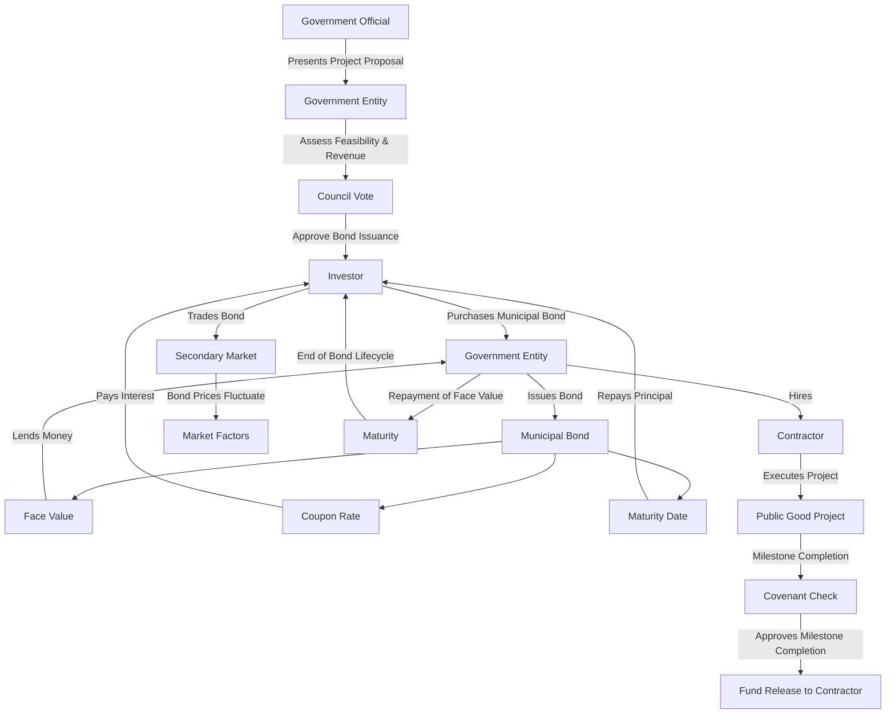
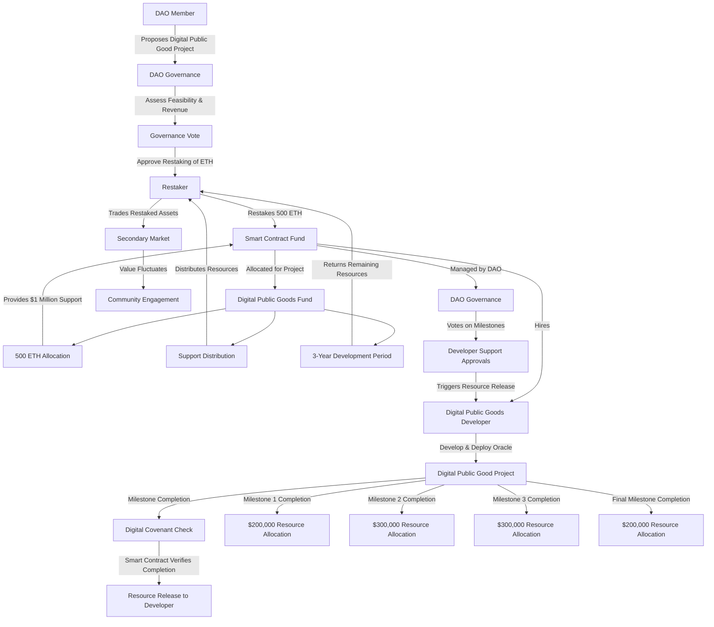

# Funding Public Infrastructure Goods, Traditionally and Digitally: Municipal Bonds and Digital Community Infrastructure Funds #

### **Problem Statement**

When a government entity or a decentralized community aims to create a large-scale public good or digital public good infrastructure project, they must efficiently raise resources, manage project execution, ensure accountability, and secure long-term sustainability. The key players involved in these processes—such as contributors, organizers, developers, and users—must align their efforts to achieve the project’s goals. The challenge is to implement a system that ensures proper resource allocation, timely project completion, and ongoing support for the infrastructure developed.

### **Key Concepts and Roles**

1. **Public Good Project/Digital Public Good Project:**
   - **[Municipal Bonds](https://hackmd.io/nvh6LsPuS7C-thhM5MFM8A?view):** The public good project is the physical infrastructure or service delivered by the contractor, such as a park, school, or utility.
   - **Digital Infrastructure Funds:** The digital public good project is the digital infrastructure or service delivered by the digital public goods developer, such as a [decentralized oracle service](https://hackmd.io/ULWdKgCBSFWHsNbYnSmjgA?view) providing decentralized data feeds.

2. **Contributor/Restaker:**
   - **Municipal Bonds:** The investor purchases the bond, providing the government entity with the capital needed for the project.
   - **Digital Infrastructure Funds:** The restaker contributes ETH or other assets to the decentralized community, which are restaked to secure and support the development and maintenance of the digital public good.

   **Key Concept: Resource Allocation**
   - In both cases, the resources raised (whether through bond purchases or restaking) are **allocated** for the specific project they were intended to support. This ensures that resources are used solely for the intended project, providing stability and focus.

3. **Organizer/Smart Contract Fund:**
   - **Municipal Bonds:** The government entity (organizer) issues the bond and manages the resources raised, ensuring they are allocated to the intended project.
   - **Digital Infrastructure Funds:** The smart contract fund manages the restaked ETH or other resources, ensuring they are specifically allocated for the development and sustainability of the digital public good project.

4. **Contractor/Digital Public Goods Developer:**
   - **Municipal Bonds:** The contractor is hired by the government entity to execute the public good project financed by the bond.
   - **Digital Infrastructure Funds:** The digital public goods developer is responsible for building and maintaining the digital infrastructure or service, with support distributed as development milestones are met.

   **Key Concept: Performance-Linked Support**
   - Support to contractors or developers in both traditional and digital infrastructure projects is **linked to performance**. Resources are disbursed only when specific milestones are achieved, ensuring accountability and efficient use of resources. This milestone-based distribution provides a mechanism to ensure that the project progresses as planned.

5. **Covenants:**
   - **Municipal Bonds:** Covenants are predefined conditions or checks that determine whether a risk to repayment has occurred or a milestone is completed/missed, allowing for the release of funds to the contractor.
   - **Digital Infrastructure Funds:** Digital covenants are [rule-based checks implemented within the smart contract](https://hackmd.io/SiL3CvuoRTib-5SEXr3sXA?view), automatically verifying risks and milestones before triggering resource disbursement.

6. **Community Engagement/Value Fluctuations:**
   - **Municipal Bonds:** The bond can be traded on the secondary market, with prices influenced by interest rates, credit ratings, and other factors.
   - **Digital Infrastructure Funds:** The value of restaked resources or associated tokens can fluctuate based on community engagement, project success, and broader market conditions.

7. **Revenue Source (Usage-Based Revenue and Resource Return):**
   - **Municipal Bonds:** Revenue from park fees or other sources directly linked to the use of the renovated infrastructure is used to make interest payments and repay the principal.
   - **Digital Infrastructure Funds:** Revenue generated from service fees, such as those from a decentralized oracle service, is utilized to cover the operational costs and ensure the ongoing support and sustainability of the digital infrastructure. If there are remaining or excess resources after meeting the project's needs, these can be returned to the original restakers as a reimbursement of unused resources.

---

### **Project Initiation Process**

Before the bond is issued or the ETH is restaked, the process begins with a stakeholder, such as a government official, community leader, or DAO member, identifying a need for a public good project. The stakeholder presents the project proposal to the relevant decision-making body (e.g., government council, DAO governance board). The proposal outlines the project's goals, benefits, costs, and potential revenue sources.

### **Municipal Bonds:**

1. **Stakeholder Proposal:** A government official presents the need for a new public infrastructure project, such as building a new school.
2. **Project Assessment:** The government entity assesses the project’s feasibility, cost, and potential revenue sources (e.g., park fees).
3. **Decision to Issue Bond:** The government council or relevant authority votes on whether to issue a municipal bond to finance the project.

#### **Municipal Bonds Graphic:**

**Explanation:**

- **Public Good Project (Public Good):** The project financed by the bond and executed by the contractor, delivering infrastructure or services to the community.
- **Investor (Resource Allocation):** Buys the bond, providing capital earmarked for a specific public good project.
- **Government Entity (Resource Allocation):** Manages the funds, ensuring they are allocated to the intended project.
- **Contractor (Performance-Linked Disbursement):** Executes the project, with payments tied to milestone completions.
- **Covenants (Milestone Verification):** Preconditions that verify milestone completion before funds are released to the contractor.
- **Secondary Market (Value Fluctuations):** Bonds can be traded, with prices influenced by various factors.
- **Maturity (Repayment):** The government repays the principal to the investor, concluding the bond's lifecycle.
- **Revenue Source (Usage-Based Revenue):** Revenue generated from park fees or other sources directly linked to the use of the renovated infrastructure ensures the repayment of bondholders.

### **Digital Community Infrastructure Funds:**

1. **Stakeholder Proposal:** A DAO member proposes the development of a digital public good, such as a [decentralized oracle service](https://hackmd.io/ULWdKgCBSFWHsNbYnSmjgA?view=).
2. **Project Assessment:** The DAO evaluates the proposal, considering the feasibility, costs, and potential revenue from usage fees or restaked resources.
3. **Decision to Restake Resources:** DAO governance votes on whether to allocate restaked ETH or other resources to support the project.
 
#### **Digital Community Infrastructure Funds Graphic:**

**Explanation:**

- **Digital Public Good Project (Digital Public Good):** The digital infrastructure or service supported by the restaked ETH and developed by the digital public goods developer, such as a decentralized oracle service providing decentralized data feeds.
- **Restaker (Resource Allocation):** Restakes ETH, providing resources allocated for a specific digital public good project.
- **Smart Contract Fund (Resource Allocation):** Manages the restaked ETH, ensuring it is used for the intended project.
- **Digital Public Goods Developer (Performance-Linked Support):** Develops and deploys the digital infrastructure or service, with support linked to milestone completions.
- **Digital Covenants (Milestone Verification):** Rule-based checks within the smart contract that automatically verify milestone completion before resources are released to the developer.
- **Community Engagement (Value Fluctuations):** The value of restaked resources or related tokens can fluctuate based on various factors, including community engagement and project success.
- **Development Period (Resource Return):** If the project is successful and all necessary milestones are met, any remaining or excess resources are returned to the restaker as a reimbursement of unused contributions.
- **Revenue Source (Usage-Based Revenue and Resource Return):** Revenue from oracle service fees ensures the ongoing support and sustainability of the digital infrastructure. If there are remaining resources after covering all costs, these are returned to the original restakers.

### **Conclusion**

In both municipal bonds and digital community infrastructure funds, the goal is to create large-scale public good projects or digital public good projects that benefit their respective communities. The concepts of **Resource Allocation**, **Usage-Based Revenue**, **Performance-Linked Support**, and **Covenants** are applied in both domains to ensure efficient support, execution, and sustainability of these projects. Despite the different tools and players involved, the underlying principles remain consistent, ensuring that these important infrastructure projects are successfully delivered to the community.
